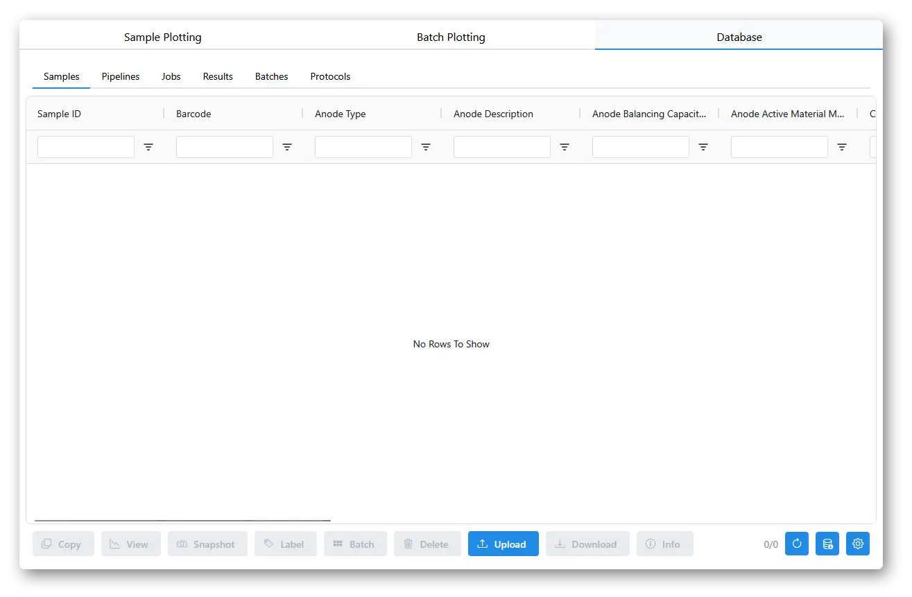
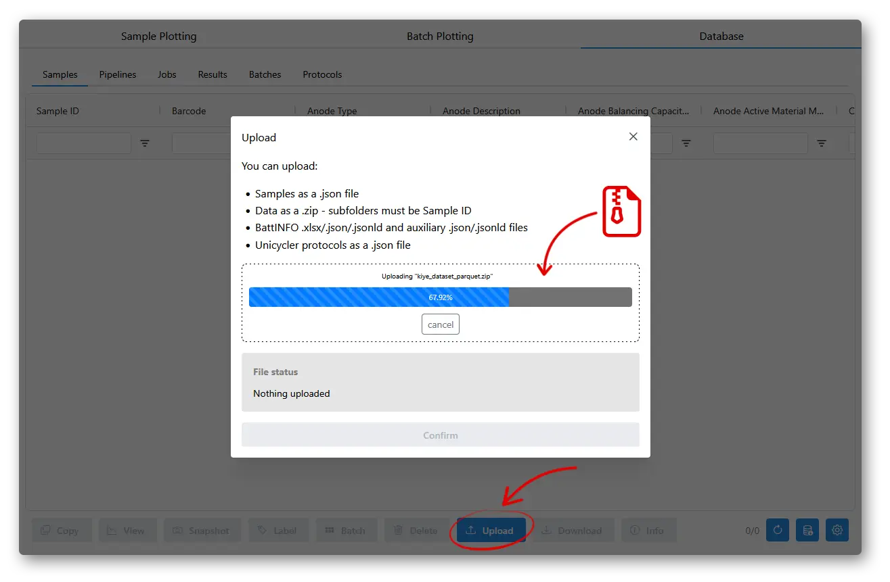
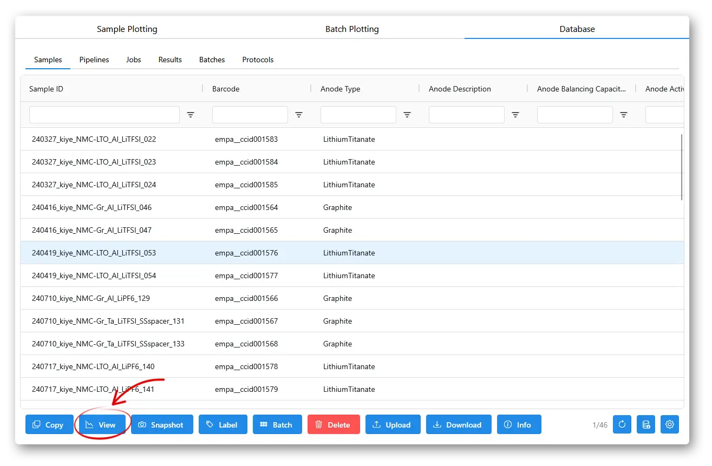
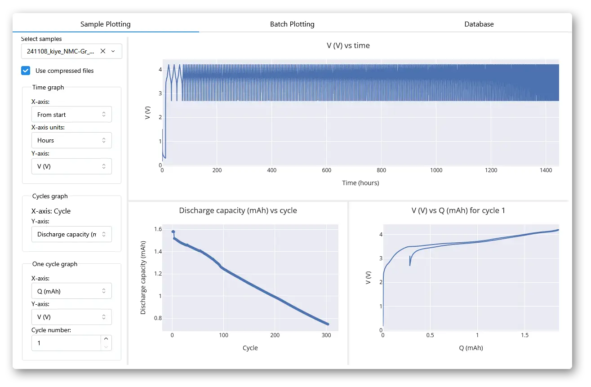

# Quickstart

## Essentials

```shell
pip install aurora-cycler-manager   # install
aurora-setup init "path/to/project" # make a project
aurora-app                          # start the app
```

## Example

Create a virtual environment in a folder with e.g. `python -m venv` or `uv venv`:


Install aurora-cycler-manager with `pip install aurora-cycler-manager`:


Create an aurora project with `aurora-setup init path/to/project` (`.` means current folder):


Start the app with `aurora-app`:


This will open an empty app:



To load some example data, you can download `kiye_dataset_parquet.zip` from [Zenodo](https://zenodo.org/records/19107066). On the `aurora-app`, go to the **Database** tab, click the **Upload** button, drag and drop the `.zip` file, scroll to the bottom and press `Confirm`.



The **Database** samples table should now show the uploaded samples.

To view the data, you can select rows in the samples table and press **View**, or go to the plotting tabs and select the samples in the menus on the left.





Here you can change the axis on the plot, and add more samples to compare. The **Batch Plotting** tab does not show full time-series data, but includes more options for coloring, styling, and aggregating data from larger numbers of samples, as well as showing correlation maps and plots for summary statistics of samples.
