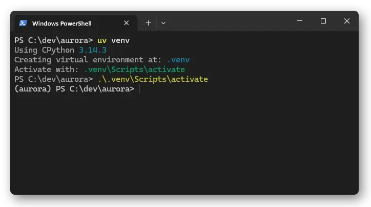
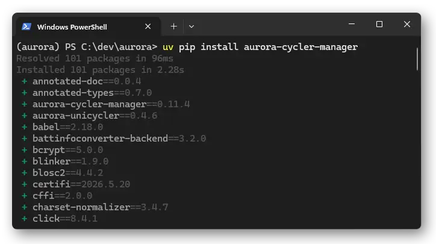

# Installation

## Install from PyPI

With Python >3.10:
```shell
pip install aurora-cycler-manager
```

To update to the latest version:
```shell
pip install aurora-cycler-manager --upgrade
```

E.g. with `uv` and a virtual environment:






## Alternate - install from source

You can also clone the repo and install with:
```shell
git clone https://github.com/EmpaEconversion/aurora-cycler-manager
cd aurora-cycler-manager
pip install .
```

Or using uv:
```shell
git clone https://github.com/EmpaEconversion/aurora-cycler-manager
cd aurora-cycler-manager
uv sync
```

## For developers

Install editable and with development dependencies:
```shell
git clone https://github.com/EmpaEconversion/aurora-cycler-manager
cd aurora-cycler-manager
pip install -e .[dev]
```
