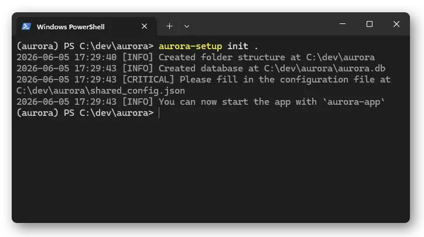

# Projects

An `aurora-cycler-manager` 'project' is a folder on a filesystem containing a configuration file and some data.

The folder structure might look like this:

```
my-aurora-folder/
├── aurora.db
├── shared_config.json
├── protocols/
└── data/
```

As a user you also have a 'user' config file stored in your user data directory (defined in [platformdirs](https://pypi.org/project/platformdirs/)).

## Connecting to an existing project

To view data from an existing set up, use:
```shell
aurora-setup connect "path\to\my-project"
```

## Creating a new project

```shell
aurora-setup init "path\to\my-project"
```

This generates subfolders, a blank sqlite3 database, and a configuration file in the folder.



## Check your project

To see where aurora is currently pointing, use
```shell
aurora-setup status      # see where your config files are
aurora-setup status -v   # see the whole config
```

## Editing the config

If you want to connect to cyclers or change columns, you need to modify the shared configuration file.

An example shared configuration looks like:
```json
{
    "Database type" : "sqlite",
    "Database path" : "path/to/my-project/aurora.db",
	"Data folder path" : "path/to/my-project/data",
    "Protocols folder path" : "path/to/my-project/protocols",
    "Time zone" : "Europe/Zurich",
    "Servers" : {
		"neware001": {
			"hostname": "neware001",
			"username": "labuser",  # this will connect with 'ssh labuser@neware001'
			"server_type": "neware",  # can be 'neware', 'biologic', 'neware_harvester', 'biologic_harvester'
			"shell_type": "powershell",  # the shell used on ssh, should be 'cmd' or 'powershell'
            "data_path": "C:/data/",  # data is saved here from Neware BTS
            "protocol_path": "C:/protocols/",  # protocols are transferred here before being on the machine
            "neware_raw_data_path": "C:/Program Files (x86)/NEWARE/BTSServer80/NdcFile/"  # this probably shouldn't change
		},
		"neware002": {
			"hostname": "neware002",
			"username": "labuser",
			"proxy_hostname": "proxypc",
			"proxy_username": "proxyuser",  # you can proxy jump through another computer, if neware002 is on a private network
			"server_type": "neware_harvester",  # harvesters cannot control the cycler, only read data
			"shell_type": "powershell",
            "data_path": "C:/data/",
            "neware_raw_data_path": "C:/Program Files (x86)/NEWARE/BTSServer80/NdcFile/"
		},
        "bio1": {
			"hostname": "biologic001",
			"username": "labuser",
			"server_type": "biologic",
			"shell_type": "powershell",
            "data_path": "C:/data/",  # biologic does not need a protocol path, the .mps is stored in the same folder as the data
		},
    },
    "Sample database" : [
        {"Name": "Cell number", "Alternative names": ["Battery_Number"], "Type": "INT"},
        {"Name": "Rack position", "Alternative names": ["Rack_Position"], "Type": "INT"},
        {"Name": "N:P ratio", "Alternative names": ["Actual N:P Ratio"], "Type": "FLOAT"},
        # ... lots more fields for the samples table in the database, you can add more if you want.
        # 'Alternative names' are normalised to the Name on sample import
        # Several columns are required and automatically added, like Sample ID, Run ID, Label.
        # You can also remove columns, but some provide special functionality, 
        # e.g. 'N:P ratio' is calculated for you if all required columns exist.
    ]
}
```

If you make changes to the database columns, you can update the database with `aurora-setup update`, use the option `--force` if you are permanently deleting columns and their data. You do not need to update after changing server details, just restart the app/daemon.

By default, aurora is set up with sqlite3, if you want to use a postgresql database instead, change your configuration to:
```json
{
    "Database type" : "postgresql",
    "Database host" : "<your-hostname>",
    "Database name" : "<your-db-name>",
    "Database user" : "<your-db-username>",
    "Database password" : "<your-very-secure-plaintext-password>",
    #... everything else is the same
}
```
Then run `aurora-setup update` to generate the tables. This requires you to have already installed and set up postgres, and created the database and users. Creating the table schema requires a superuser.
