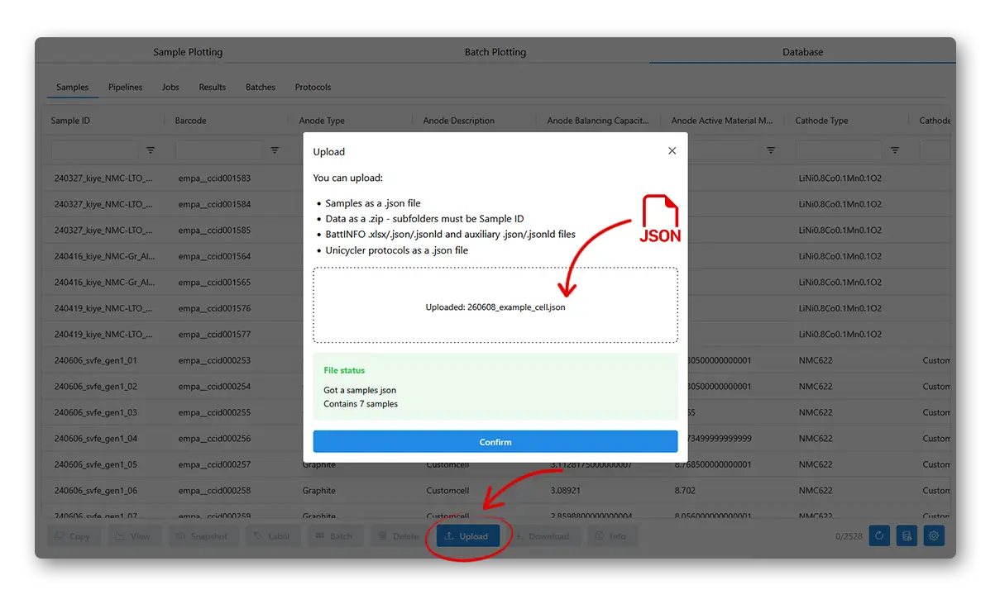
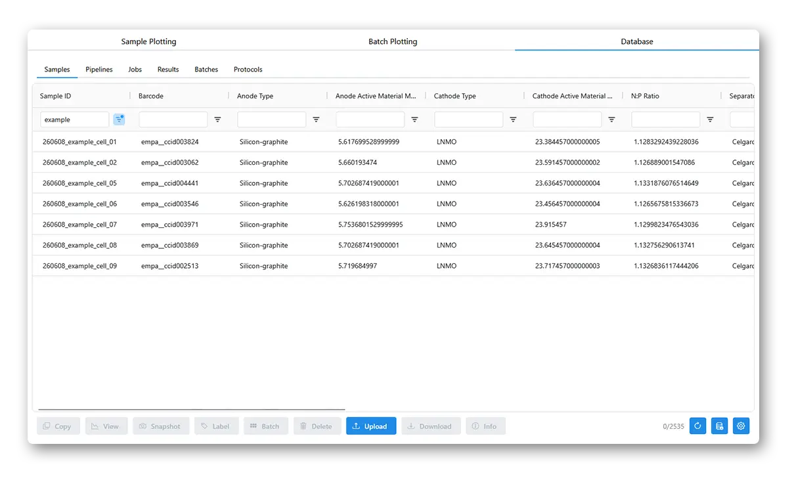

# Adding samples

To upload sample information to the database, use the 'Upload' button in the database tab, and select a .json file defining the cells.

The .json file should look like:
```python
[
    {
        "Sample ID": "my_cell_001",
        # Other keys that are columns in the database
    },
    {
        "Sample ID": "my_cell_002",
        # Other keys that are columns in the database
    }
    # etc.
]
```



The samples should immediately be visible in the Samples tab. Here we use a filter in the table to only show the samples we just added.



You can change the JSON and upload to overwrite sample details. You will be warned if sample information is being overwritten. You can also **Delete** samples -- this is only a *soft* delete, and will not remove any associated data.
