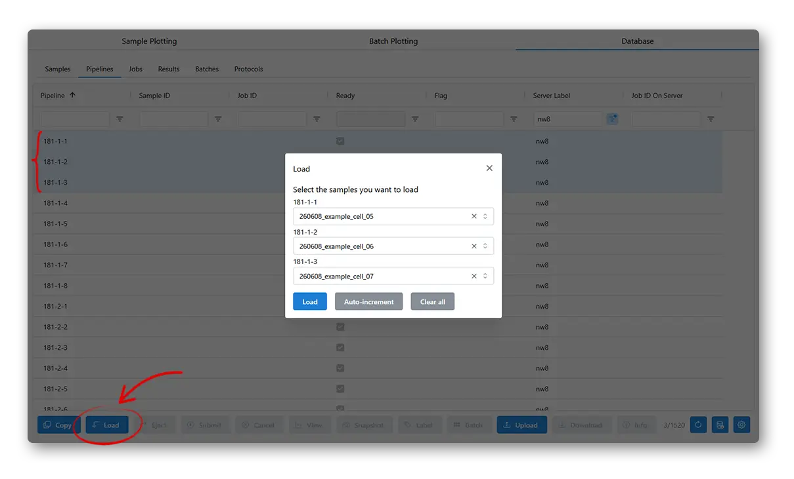
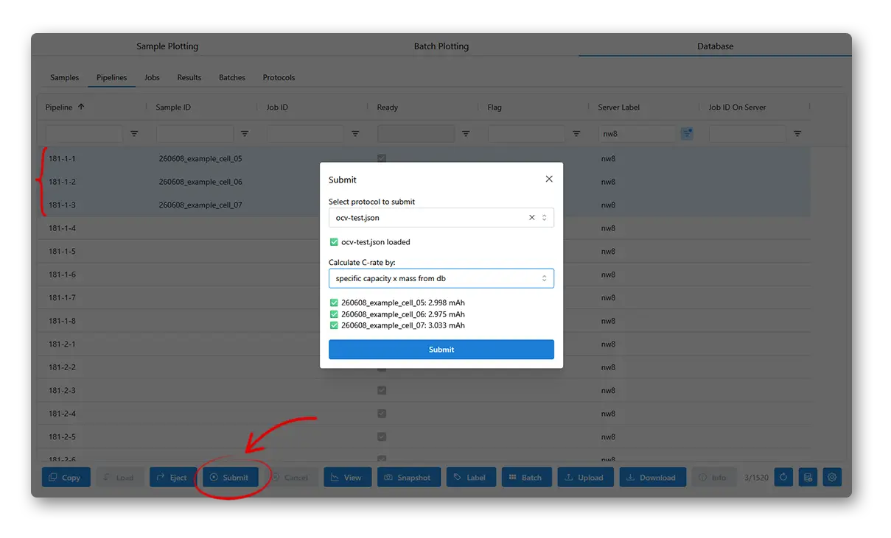
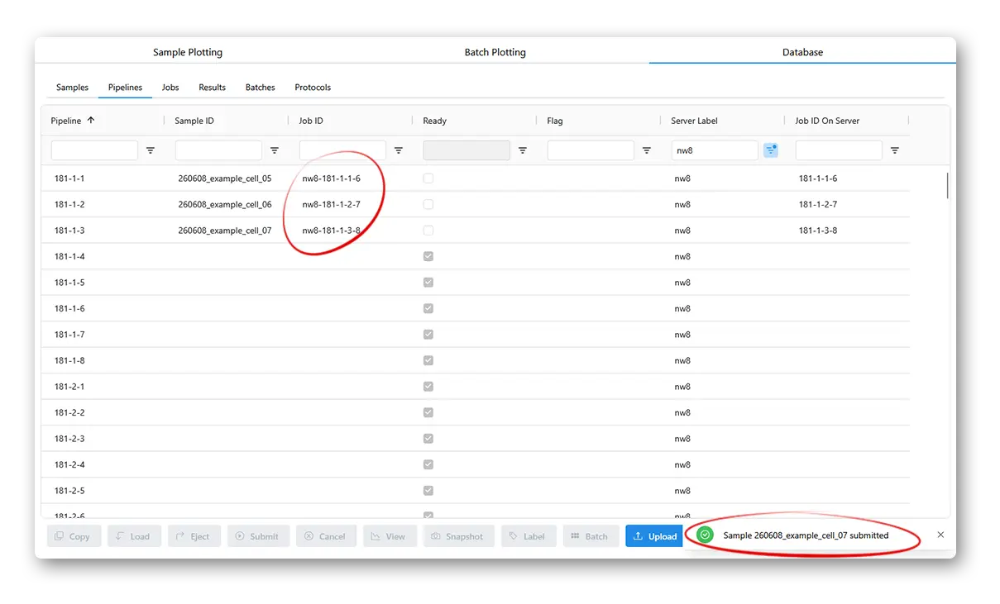

# Starting an experiment

Now you have a sample and a protocol. Go to **Database** tab, **Pipelines** table, click on a pipeline, press the **Load** button and select your sample.

(You need to also put the actual sample on the physical machine)

Now select the loaded sample, press **Submit**, choose a protocol and a way to define C-rate, then submit it.

If the job submits successfully, you will see a **Job ID** in the table. The experiment is now running and you can **Snapshot** (fetch the latest data from the cycler machine) and **View** the data.

You can also **Cancel** a running experiment to stop it immediately.
