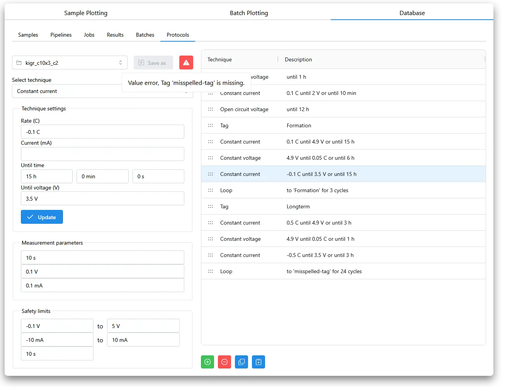

# Defining a cycling protocol

Go to **Database** tab, then click **Protocols**.

The right panel shows the full protocol, with add/delete/copy/paste step buttons below. The left panel contains controls for step and global parameters.

A warning symbol at the top tells you if something is causing the protocol validation to fail, here we tell the protocol to loop back to a tag that does not exist. When warnings are resolved, the 'Save as' button can be used, and we can overwrite the existing protocol file or create a new one.

Protocol files are [`aurora-unicycler`](https://github.com/empaeconversion/aurora-unicycler) JSON files, they can be edited by hand or created with the `aurora-unicycler` python package and loaded into `aurora-cycler-manager` either by putting files directly in the `protocols` folder of the project, or by uploading them through the app interface.
