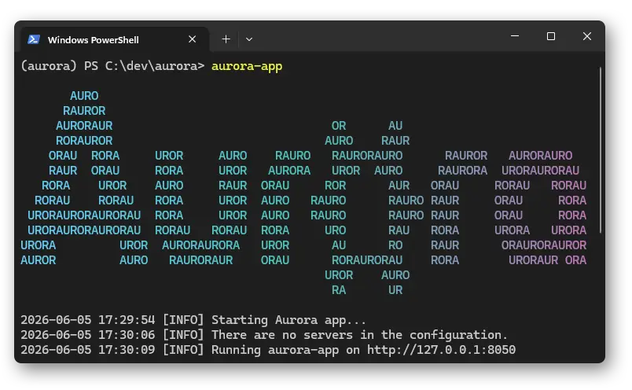

# Starting the app

Open the app with:
```shell
aurora-app
```



The web app allows users to view analysed data, see the status of samples, jobs, and cyclers, and submit jobs to cyclers if they have access.

There are three tabs: samples plotting, batch plotting, and database.
